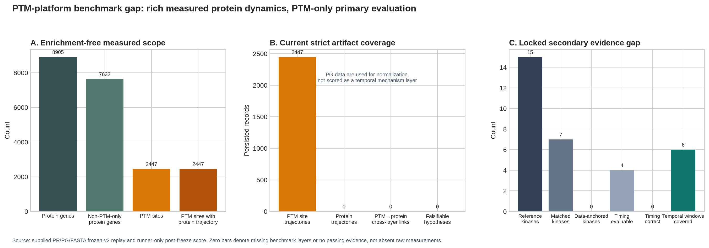

# Enrichment-free PTM–Protein Temporal Mechanism Benchmark 경쟁력 재검토

**작성자:** Manus AI

**검토 대상:** supplied PR/PG/FASTA frozen-v2 replay, insulin runner-only locked reference, PTM-platform Report/RAG/Co-Scientist runtime

**검토 원칙:** strict blind primary analysis와 post-freeze scoring을 분리하며, RAG·LLM은 canonical score와 변수 선택에 사용하지 않는다.

## 1. 결론

현재 benchmark는 **PTM site mapping, Temporal Wave, TMM, uncertainty, cascade를 엄격한 blind 환경에서 재현하는 benchmark**로는 강해졌다. 그러나 PTM-platform의 핵심 차별점인 **enrichment-free phosphoproteome과 global proteome을 동일 시간축에서 연결하고, 관측·계산·문헌·후속 검증을 분리한 기전 가설을 만드는 능력**은 아직 primary benchmark의 평가 대상이 아니다.

실제 preprocessing output에는 8,905개 protein gene의 6-point trajectory와 2,447개 PTM site trajectory가 있다. PTM 2,447개 site 모두 동일 gene의 protein trajectory와 연결할 수 있고, 901개 site에서는 PTM absolute peak가 protein absolute peak보다 먼저 관측된다. 그러나 현재 strict artifact에는 protein trajectory, PTM→protein cross-layer relation, falsifiable hypothesis record가 각각 0개다. 따라서 PG matrix는 주로 PTM normalization에 사용되고, 풍부한 non-PTM temporal layer는 benchmark value로 환산되지 않는다.



> **핵심 판단:** 현재 benchmark는 플랫폼의 계산 엔진을 평가하지만, 플랫폼이 제공하려는 과학적 산출물인 “time-resolved, evidence-linked, falsifiable mechanism hypothesis”를 아직 평가하지 않는다.

## 2. 실제 데이터와 현재 benchmark의 범위

| Evidence layer | 실제 frozen raw output | 현재 strict benchmark | 경쟁력 손실 |
|---|---:|---|---|
| PTM site time-course | 2,447 sites | Wave·TMM·site score에 사용 | 평가됨 |
| Protein time-course | 8,905 genes | PTM normalization에는 사용되나 score artifact에 없음 | 매우 큼 |
| PTM peptide가 없는 non-PTM protein | 7,632 genes | 평가되지 않음 | 매우 큼 |
| PTM site–same-gene protein pair | 2,447 pairs | artifact cross-layer field 0 | 큼 |
| PTM peak가 protein peak보다 이른 pair | 901 pairs | descriptive/robustness benchmark 없음 | 큼 |
| Kinase reference | 15 entries | 7 matched, 6 single-resolution | 부분 평가 |
| Data-anchored kinase | 0 | 0/15 | 해결 필요 |
| Timing-evaluable kinase | 4 | 0/4 correct | 해결 필요 |
| Temporal biological windows | 7 | 6 covered by any Wave peak | 너무 약한 surrogate |

현재 `benchmark_artifact.py`는 normalized PTM vector만 읽어 `site_observations`, Wave와 TMM을 기록한다. `branch_evidence`는 빈 배열이고 protein trajectory를 읽지 않는다. Secondary temporal-layer metric도 각 biological window 안에 **어떤 Wave peak라도 존재하는지**만 평가하므로, receptor/kinase→substrate→non-PTM effector의 연결을 검증하지 않는다. Primary chain completeness도 explicit ordered-layer record가 없으면 branch당 검출 anchor가 2개 이상인지로 축약된다.

## 3. `data-anchored kinase coverage = 0`의 정확한 의미

### 3.1 결과 분해

Runner-only secondary score에서 15개 reference 중 7개는 alias 수준에서 어떤 prediction과 매칭됐고, 6개는 single prediction으로 해석됐다. 그러나 matched prediction의 evidence는 모두 `tmm_prior_assisted`였고 `tmm_data_anchored`는 0이었다. 대표적으로 MTOR, AKT1, GSK3B, MAPK와 PRKAA1은 모두 `gaussian_fallback` profile이었다.

따라서 이 0은 “insulin signaling이 데이터에 없다”는 뜻이 아니다. **현재 candidate kinase profile을 직접 지지하는 exclusive substrate consensus 또는 curated site-specific kinase evidence가 strict artifact에서 형성되지 않았다**는 뜻이다.

### 3.2 코드 수준 원인

현재 direct annotation은 Order-level species에서 organism code 하나를 정하고 gene name으로 iPTMnet/UniProt를 조회한다. 그러나 supplied FASTA는 rat proteome과 human INSR가 섞인 mixed-species reference다. Order species가 rat이면 human INSR query에도 rat organism filter가 적용될 수 있다. 또한 preprocessing에서 확보한 protein accession과 FASTA record별 taxonomy provenance를 direct kinase lookup의 primary key로 사용하지 않는다.

이 구조는 다음 문제를 만든다.

| 문제 | 현재 동작 | 필요한 동작 |
|---|---|---|
| Mixed species | Order-level species 한 개 | FASTA record/accession별 OX taxonomy |
| Protein identity | gene-name search 우선 | trusted accession direct lookup 우선 |
| Site mapping | reported position direct comparison | sequence/isoform-aligned canonical position |
| Direct evidence absence | motif-only Gaussian fallback | observed kinase PTM·curated substrate·empirical substrate consensus를 분리 |
| Database reproducibility | live API outcome | versioned snapshot/hash와 retrieval audit |

### 3.3 해결 목표

`data-anchored coverage`를 높이기 위해 gate를 낮춰서는 안 된다. 다음 네 channel을 독립적으로 보존해야 한다.

| Channel | Data-anchor 여부 | 역할 |
|---|---|---|
| Kinase 자체의 observed regulatory/autophosphorylation site | Yes, site role이 curated된 경우 | direct activity timing anchor |
| Curated kinase–substrate interaction이 실제 measured site와 정확히 일치 | Yes | data-anchored substrate profile |
| 충분한 exclusive substrate의 replicate-stable consensus | Yes, empirical tier | data-derived kinase profile |
| Sequence motif/background likelihood | No | candidate prior only |

Per-accession lookup을 적용한 뒤에도 coverage가 0이면 그 값은 데이터 또는 public annotation coverage의 정직한 한계가 된다. 그러나 현재 0은 mixed-species/accession-aware lookup과 observed kinase-PTM channel을 충분히 시험하기 전의 값이므로 해결 대상으로 두는 것이 맞다.

## 4. `timing accuracy = 0`의 정확한 의미와 재정의

Timing denominator 4개는 모두 prior-assisted Gaussian prediction이었다. Observed peak는 30 또는 180 min이었고 reference window는 early 계열이어서 0/4가 됐다. 이 metric은 현재 **direct data-anchored timing accuracy가 아니라 prior-assisted matched-profile timing accuracy**다.

다음처럼 분리해야 한다.

| Metric | 정의 | 해석 |
|---|---|---|
| `timing_accuracy_all_matched` | 모든 uniquely matched profile의 timing | descriptive |
| `timing_accuracy_data_anchored` | direct/empirical data-anchored profile만 | primary kinase timing metric |
| `timing_coverage_data_anchored` | data-anchored timing denominator / reference kinase denominator | detectability metric |
| `timing_error_minutes` | peak 또는 onset과 reference window의 거리 | exact mismatch magnitude |
| `timing_interval_overlap` | bootstrap/LOTO peak interval과 expected window overlap | uncertainty-aware timing |

Data-anchored denominator가 0이면 timing accuracy는 **0이 아니라 `not_evaluable`**이어야 한다. Gaussian prior의 peak mismatch는 별도 discovery diagnostic으로 남긴다.

## 5. Enrichment-free 경쟁력을 반영하는 benchmark v2

Time-resolved phosphoproteome과 proteome의 결합은 빠른 phosphorylation response와 더 늦은 protein-abundance program을 구분하고, signaling에서 downstream regulation으로 이어지는 연결을 관찰할 수 있게 한다.[1] 따라서 benchmark의 평가 단위는 phosphosite 목록이 아니라 **evidence chain**이어야 한다.

### 5.1 제안하는 5-layer evidence graph

| Layer | Artifact | 허용 주장 |
|---|---|---|
| E0 Measurement | replicate-level PTM/protein trajectory, q-value, missingness | observed change |
| E1 Temporal structure | Wave, onset/peak interval, soft membership | co-movement and precedence |
| E2 Kinase attribution | direct/empirical/prior tier, contribution CI | candidate attribution |
| E3 Protein follow-through | non-PTM effector trajectory, same/cross-gene lag, network source | observational propagation support |
| E4 Literature and test | ChromaDB passage/PMID/DOI, counter-evidence, perturbation proposal | contextualized falsifiable hypothesis |

각 edge는 `source`, `target`, `observation_ids`, `attribution_tier`, `lag_minutes`, `uncertainty`, `network_source`, `literature_ids`, `causality_status=not_tested`를 가진다.

### 5.2 새로운 primary mechanism metrics

| Metric | 산식 개념 | 목적 |
|---|---|---|
| Protein temporal coverage | benchmark-eligible protein trajectories / reference proteins | non-PTM 활용량 |
| Cross-layer transition coverage | evaluable PTM→protein relations / reference relations | layer 연결성 |
| Cross-layer timing accuracy | observed lag interval과 locked expected order/window overlap | temporal mechanism |
| Mechanism chain completeness | E0→E1→E2→E3 중 evidence-qualified ordered layers | end-to-end capability |
| Data-anchored kinase coverage | direct/empirical kinase predictions / reference kinases | kinase evidence |
| Evidence-calibrated precision | confidence tier별 correct/incorrect rate | calibration |
| Hypothesis support precision | post-freeze locked chain으로 supported인 generated hypotheses 비율 | scientific output quality |
| Refutation sensitivity | locked counterexample을 `refuted/insufficient`로 처리한 비율 | 과도한 확신 억제 |

Canonical phosphosite score는 유지하되, mechanism score와 합치지 않고 **두 개의 독립 axis**로 보고해야 한다. 그래야 known-pathway recovery와 enrichment-free discovery capability를 구분할 수 있다.

## 6. RAG·LLM 병용으로 증가하는 데이터 가치

LLM은 numeric inference engine이 아니다. Wave, TMM, uncertainty와 lag 계산은 deterministic code가 수행해야 한다. LLM의 가치는 구조화된 quantitative evidence와 제한된 ChromaDB literature 사이를 연결하는 데 있다. Scientific LLM은 명확한 평가 metric, 인간의 과학적 목표와 tool-based integration이 필요하며, prompt만으로 복잡한 과학 계산을 신뢰할 수 있다는 전제는 부적절하다.[2]

| 데이터 가치 상승 | Deterministic data만 | +RAG | +RAG·LLM |
|---|---|---|---|
| 7,632 non-PTM protein | large time-series table | relevant pathway/role literature retrieval | PTM Wave 이후의 effector program으로 구조화 |
| 2,447 PTM–protein pairs | lag/discordance 계산 | known regulation·complex·pathway evidence | supported·contradicted mechanism alternatives 비교 |
| Kinase ambiguity | contribution/CI | curated kinase–substrate evidence 검색 | family ambiguity와 alternative kinase hypothesis 설명 |
| Novel PTM | sequence/mapping/temporal evidence | same-gene/function literature | site-specific claim과 gene-level context를 명확히 분리 |
| Cross-wave cascade | observational graph | published pathway fragments | missing link·counter-evidence·validation experiment 제안 |

RAG는 literature를 추가하는 기능이 아니라 **관측값이 의미할 수 있는 관계의 후보공간을 제한하고 출처를 부여하는 계층**이다. Biomedical RAG/KG 연구에서도 entity normalization, cross-document relation과 source traceability가 핵심이다.[3] LLM은 그 위에서 다음을 수행할 수 있다.

1. 서로 다른 evidence tier를 한 문장에 혼합하지 않고 observation→attribution→literature→test 순으로 서술한다.
2. 동일 data를 설명하는 경쟁 가설을 최소 2개 만들고, 각 가설의 supporting·contradicting evidence를 비교한다.
3. non-PTM trajectory가 PTM effect와 concordant인지, delayed인지, discordant인지 설명한다.
4. 사용자의 ChromaDB에 있는 연구와 현재 데이터가 같은 점과 다른 점을 분리한다.
5. inhibitor, phospho-mutant, orthogonal assay 등 **분석 후 검증 실험**을 제안한다.

### 6.1 현재 Report/Co-Scientist 코드의 강점

현재 Co-Scientist context는 temporal cascade, co-wave, autophosphorylation, TMM, multisite divergence와 observational directionality를 수집한다. External Co-Scientist packet은 observed PTM site와 re-resolved ChromaDB literature가 모두 존재하고 limitation이 포함된 candidate만 writer에 전달한다. 이는 좋은 기반이다.

### 6.2 현재의 중요한 gap

| 코드 경로 | 현재 문제 | 영향 |
|---|---|---|
| `data_verification_node.py` | Type A–D가 PTM/kinase 중심이며 non-PTM cross-layer verification 없음 | 기전 chain을 실데이터로 직접 검증하지 못함 |
| `external_coscientist_node.py` | quality gate가 observed PTM site+literature 중심 | non-PTM trajectory·lag·contradiction이 필수조건이 아님 |
| `dynamic_prompt_generator.py` | non-PTM을 kinase–substrate 관계를 “VALIDATE”한다고 표현 | observational data를 validation으로 과장 |
| same prompt | “confirming temporal causality”, “suggesting causal regulatory relationships” 문구 | 시간 선후를 causal claim으로 오해 |
| `temporal_analysis.py` crosstalk | positive lag를 `direction="causal"`로 저장 | 기존 DirectedTemporalRelationship 원칙과 불일치 |
| benchmark artifact | protein/cross-layer/hypothesis field 없음 | RAG·LLM 상승가치를 score할 수 없음 |

이 wording과 schema는 플랫폼 전체에 v2 알고리즘을 승격하기 전에 수정해야 한다. `causal`, `validate`, `confirming causality`를 `temporal_precedence_supported`, `cross-layer_support`, `consistent_with`로 바꾸고, causal validation은 perturbation이 업로드된 경우에만 별도 필드로 평가해야 한다.

## 7. Leakage-safe RAG·LLM benchmark 설계

RAG·LLM은 strict primary benchmark에서 계속 제외해야 한다. 대신 configuration freeze 뒤의 별도 **interpretation benchmark**로 평가한다. expanded kinase network가 coverage를 크게 늘려도 accuracy 개선은 제한적일 수 있고, ground truth 밖의 interaction이 많다는 최근 benchmark 결과는 coverage·accuracy·discovery를 분리해야 함을 보여준다.[4]

| Track | Input | Reference access | 평가 |
|---|---|---|---|
| A. Numeric blind | raw PR/PG/FASTA | 없음 | Wave/TMM/cross-layer reproducibility |
| B. Retrieval | frozen artifact + user ChromaDB | workbook truth 없음 | retrieval precision/recall, citation validity |
| C. Hypothesis generation | A+B evidence only | workbook truth 없음 | schema completeness, grounding, alternative hypotheses |
| D. Locked interpretation score | archived hypotheses | runner-only truth | support precision, refutation sensitivity, chain accuracy |
| E. Perturbation validation | optional later inhibitor data | uploaded perturbation only | perturbation-supported upgrade |

Hypothesis는 다음과 같은 machine-readable card로 고정한다.

```json
{
  "hypothesis_id": "H-001",
  "observation_ids": ["PTM:GENE_S123", "PROTEIN:GENE"],
  "temporal_claim": {"type": "precedence", "lag_minutes": 25, "tier": "D2"},
  "kinase_attribution": {"candidate": "KINASE", "tier": "empirical", "ci": [0.2, 0.7]},
  "non_ptm_follow_through": [{"gene": "EFFECTOR", "class": "delayed_concordant"}],
  "literature_support": [{"collection": "user_chromadb", "pmid": "...", "passage_id": "..."}],
  "counter_evidence": [],
  "testable_prediction": "...",
  "falsification_test": "...",
  "causality_status": "not_tested"
}
```

## 8. 개발 우선순위

### P0 — 플랫폼 전체 v2 승격 전 필수

| 개발 | Acceptance criterion |
|---|---|
| Protein temporal artifact | 8,905 gene trajectories와 missingness·replicate provenance 보존 |
| PTM–protein cross-layer engine | same-gene 및 network-linked pair를 DirectedTemporalRelationship로 계산; causal wording 0건 |
| Accession/species-aware direct kinase annotation | FASTA accession+OX 우선, gene fallback provenance, mixed-species regression |
| Kinase timing metric 재정의 | data-anchored denominator 0이면 `not_evaluable`; prior-assisted timing 분리 |
| Report wording repair | `validate/causal/confirm` overclaim regression test |
| Co-Scientist verification Type E/F | non-PTM follow-through와 full mechanism-chain verification |

### P1 — benchmark competitiveness

| 개발 | Acceptance criterion |
|---|---|
| Workbook v2 cross-layer reference | protein effector, expected order/window, evidence tier를 runner-only로 추가 |
| Mechanism-chain scorer | E0–E4 layer completeness와 timing accuracy를 primary canonical score와 분리 |
| RAG retrieval audit | claim마다 collection/document/passage와 retrieval score 저장 |
| Hypothesis card contract | observation·attribution·literature·counter-evidence·falsification 필수 |
| Numeric/RAG/LLM ablation | A/B/C track 비교, 동일 frozen artifact 사용 |

### P2 — 논문 확장

| 개발 | Acceptance criterion |
|---|---|
| Independent stimulus dataset | insulin 밖의 time-course dataset에서 frozen v2 재현 |
| Post-analysis inhibitor validation | 선정 D2/D3 hypothesis가 perturbation-supported로 승격되는지 평가 |
| Expert blind review | mechanism utility, traceability, falsifiability를 blinded rubric으로 평가 |

## 9. 논문 전략

논문의 중심 claim은 “insulin reference kinase를 얼마나 많이 맞혔는가”가 아니라 다음이어야 한다.

> **PTM-platform converts enrichment-free time-course phosphoproteome and proteome measurements into a blind, uncertainty-aware evidence graph that generates traceable and falsifiable signaling hypotheses.**

권장 figure 구조는 다음과 같다.

| Figure | 메시지 |
|---|---|
| Figure 1 | Blind input, E0–E4 evidence layers, locked scoring boundary |
| Figure 2 | Canonical phosphosite recovery와 data-anchored kinase/timing을 분리 |
| Figure 3 | PTM Wave→protein effector follow-through와 concordant/discordant lag |
| Figure 4 | Full mechanism hypothesis cards, counter-evidence, validation proposal |
| Supplement S1 | Numeric only vs +RAG vs +RAG·LLM ablation |
| Supplement S2 | Candidate network coverage–accuracy trade-off, uncertainty calibration |

현재 insulin dataset은 signal discovery와 canonical recovery를 보여줄 수 있다. 그러나 direct kinase timing과 causal validation은 별도 evidence로 제한해야 한다. 이후 inhibitor dataset은 unbiased discovery 이후에 선택한 hypothesis를 검증하는 독립 단계로 사용하면 논리적 순환을 피할 수 있다.

## 10. 최종 답변

1. **현재 benchmark는 플랫폼 경쟁력을 부분적으로만 반영한다.** PTM temporal engine은 평가하지만 enrichment-free non-PTM follow-through와 falsifiable mechanism hypothesis는 평가하지 않는다.
2. **RAG·LLM을 플랫폼 전체에 결합하면 데이터의 가치는 증가한다.** 7,632개 non-PTM-only protein과 2,447개 PTM–protein pair가 literature-grounded mechanism alternatives와 validation tests로 전환될 수 있기 때문이다.
3. **`data-anchored kinase coverage=0`은 해결해야 한다.** 먼저 accession/species-aware annotation과 observed kinase PTM·exclusive-substrate channel을 구현해야 한다. 그 후에도 0이면 정직한 data limitation이다.
4. **`timing accuracy=0`은 현재 정의가 부적절하다.** Prior-assisted Gaussian timing과 data-anchored timing을 분리하고, data-anchored denominator가 0이면 `not_evaluable`로 보고해야 한다.
5. **플랫폼 전체 승격 전 causal wording을 반드시 고쳐야 한다.** 시간 선후와 protein follow-through는 기전 가설의 근거이지 causal validation 자체가 아니다.

## References

[1]: https://pmc.ncbi.nlm.nih.gov/articles/PMC9198430/ "Time-resolved phosphoproteome and proteome analysis reveals kinase signaling on master transcription factors during myogenesis"
[2]: https://www.nature.com/articles/s44387-025-00019-5 "Exploring the role of large language models in the scientific method: from hypothesis to discovery"
[3]: https://pmc.ncbi.nlm.nih.gov/articles/PMC12448786/ "A retrieval-augmented knowledge mining method with deep thinking LLMs for biomedical research and clinical support"
[4]: https://www.nature.com/articles/s41467-026-69332-0 "Benchmarking EGF signaling pathway inference using phosphoproteomics and kinase-substrate interactions"
