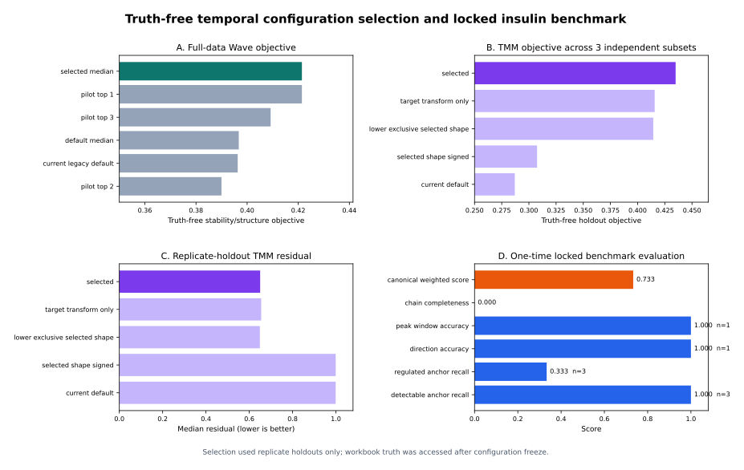

# Insulin time-course phosphoproteomics benchmark 최적화 연구 및 논문 전략 v1

**작성자:** Manus AI  
**분석 기준 코드:** `truth_free_temporal_optimized.v1`  
**배포 runtime configuration SHA-256:** `7b9674a29bde3f094f40e0bb6323f1c3d1ba99b075a801f00e26de9d6825a28c`  
**Optimization selection record SHA-256:** `2c625933b8fdab6fe59f7bc48eee00ee1698b1f4f253df86e1099fb79f618c62`

## 1. 결론 요약

첨부된 `Insulin_Signaling_Phospho_Kinase_Benchmark_v1.xlsx`의 SHA-256은 `a2cb7d6ab1167983198f80627ca412cdde78530cdfe0ecd9dbc6849f073ab484`이며, runner-only locked truth에 기록된 원본 workbook hash와 일치한다. 따라서 현재 benchmark reference는 사용자가 다시 제공한 바로 그 파일이다. Workbook은 분석·RAG·Report·LLM runtime에 전달되지 않고, configuration 동결 후 offline locked scoring에서만 사용되었다.

실제 PR/PG matrix와 Rat+human INSR FASTA를 사용한 truth-free nested optimization은 **site aggregation을 `median`**, Wave minimum amplitude를 **0.40**, TMM profile 생성에 필요한 exclusive substrate 수를 **5**, Gaussian prior의 log-time sigma를 **0.80**, TMM target transform을 **magnitude**로 선택했다. 이 configuration은 workbook 점수를 최대화해 선택한 것이 아니라 3개 replicate outer holdout의 Wave 재현성, profile 안정성, shared-site holdout reconstruction과 parsimony를 결합해 선택했다. Hyperparameter 선택과 최종 성능 추정을 같은 자료에서 수행하면 낙관적 편향이 발생할 수 있으므로, locked workbook은 선택 단계에서 차단했다.[1] [2]

최적 configuration은 전체 site를 사용한 Wave 비교에서 truth-free objective **0.4214**로 현재 legacy default의 **0.3963**보다 6.34% 높았고, 세 개의 독립적인 deterministic shared-site subset에서 TMM objective 평균 **0.4349**로 현재 default의 **0.2870**보다 51.55% 높았다. Replicate-holdout median residual은 **0.6503**으로 현재 default의 **0.9989**보다 34.90% 감소했다. 선택 후 단 한 번 수행한 locked evaluation의 canonical weighted score는 **0.7333**이었다.

다만 locked canonical score의 유효 denominator는 매우 작다. Detectable 및 regulated anchor denominator는 각각 3이고, direction 및 peak-window denominator는 각각 1이다. 따라서 본 결과는 “insulin signaling 전체를 완전히 재구성했다”는 결론이 아니라, **엄격히 검출 가능한 canonical anchor에서는 direction과 peak timing이 맞았으나 regulated anchor coverage와 chain completeness에는 개선 여지가 남는다**는 결론으로 기술해야 한다.

## 2. 연구 질문과 사전 정의된 평가 구조

이 연구의 중심 질문은 “insulin이라는 자극원과 biological question을 숨긴 상태에서, 고감도 time-course phosphoproteomics만으로 canonical signaling recovery, co-moving temporal structure, multi-kinase attribution과 observed temporal cascade를 얼마나 재현할 수 있는가?”이다. 일반적인 kinase activity benchmark는 perturbation과 known kinase–substrate prior를 이용해 expected kinase–condition pair를 평가해 왔으며, substrate 수와 interaction evidence가 성능에 큰 영향을 주는 것으로 보고되었다.[3] 본 연구는 여기에 strict stimulus/question blindness, condition-level Wave, shared-site TMM attribution, replicate holdout optimization과 explicit directionality evidence tier를 추가한다.

| 층 | 분석 runtime에서 허용되는 정보 | 평가 시점 | 역할 |
|---|---|---|---|
| 0층 preprocessing | PR/PG matrix, replicate, numeric timepoint, FASTA | 분석 중 | protein-normalized site trajectory 생성 |
| 1층 temporal science | site trajectory, sequence/motif candidate, Wave, TMM | 분석 중 | temporal structure 및 multi-candidate attribution |
| Locked canonical scoring | runner-only workbook truth | configuration 동결 후 1회 | 외부 reference와의 일치도 평가 |
| Discovery layer | Tier 3/4 및 de novo candidate | scoring과 분리 | 새로운 signaling candidate 보존 |
| Perturbation validation | 향후 inhibitor 또는 orthogonal assay | 후속 연구 | D2/D3 candidate의 perturbation support 평가 |

## 3. 분석 변수의 정의

변수는 **동결 변수**, **truth-free 최적화 변수**, **후속 검증 변수**로 구분했다. Species mapping, workbook matching, evidence tier, blind boundary와 locked scorer weight를 데이터에 맞춰 조정하면 benchmark 자체가 변하므로 동결했다. 반면 site aggregation, Wave threshold와 TMM profile/target transform은 raw replicate 재현성과 holdout reconstruction으로 선택할 수 있는 일반 알고리즘 변수로 정의했다.

| 범주 | 변수 | 탐색 범위 또는 상태 | 최종값 | 선택 근거 |
|---|---|---|---|---|
| Preprocessing | site aggregation | legacy last / mean / median | **median** | duplicate precursor order 의존성 제거와 replicate stability |
| Wave | correlation threshold | 0.55–0.85 | **0.70** | fold-wise cluster stability와 within-Wave coherence |
| Wave | minimum variance | 0.10–0.50 | **0.30** | flat trajectory 제외 |
| Wave | minimum amplitude | 0.40–1.20 | **0.40** | 높은 coherence를 유지하며 assigned fraction 회복 |
| Wave | minimum cluster size | 2–4 | **2** | small coherent wave 보존 |
| Wave | maximum waves | 6–12 | **8** | complexity 제한과 temporal diversity 균형 |
| TMM | minimum exclusive substrates | 2–6 | **5** | profile correlation 향상과 sparse prior 경계 명시 |
| TMM | Gaussian sigma in log-time | 0.40–1.00 | **0.80** | holdout reconstruction 및 profile stability |
| TMM | target transform | signed / magnitude | **magnitude** | 비음수 mixture가 activation magnitude를 표현하도록 contract 일치 |
| TMM guard | identifiability 및 withheld ratio | 동결 | 동결 | ambiguous share의 과도한 publication 방지 |
| Directionality | bootstrap/permutation/LOTO | 동결 | 동결 | temporal precedence evidence tier 보존 |
| Locked scoring | anchor identity, weights, windows | 동결 | 동결 | post-selection external test 유지 |

`magnitude` target transform은 negative site를 activation이라고 재명명하지 않는다. Site-level signed trajectory는 그대로 보존되며, TMM NNLS는 kinase contribution의 **크기 분해**에 사용된다. Figure와 source data는 signed input, magnitude attribution, directionality를 서로 다른 필드로 유지해야 한다.

## 4. Truth-free nested optimization 방법

세 replicate를 이용해 각 fold에서 두 replicate를 training, 나머지 한 replicate를 validation으로 두었다. Site trajectory와 candidate graph는 analysis artifact에서만 읽었으며, workbook과 insulin label은 optimization process에서 사용할 수 없었다. Wave search는 deterministic 250-site subset에서 configuration을 탐색한 뒤 선택 configuration을 전체 2,447개 site에 재적용했다. TMM은 shared-candidate site를 SHA-256 기반으로 고정 추출해 configuration을 선택한 뒤, 서로 다른 salt를 사용하는 세 개의 독립 300-site subset에서 ranking을 다시 확인했다.

Wave objective는 다음과 같이 정의했다.

> **Wave objective = 0.45 × max(ARI, 0) + 0.25 × within-Wave correlation + 0.20 × assigned fraction + 0.10 × peak diversity − 0.05 × excess complexity**

여기서 ARI는 training과 held-out replicate의 cluster membership 일치도를 나타낸다. TMM objective는 다음과 같이 정의했다.

> **TMM objective = 0.35 × residual score + 0.20 × top-1 attribution stability + 0.20 × profile correlation + 0.15 × equal-weight 대비 residual improvement + 0.10 × data-driven profile fraction**

Model-selection criterion 자체도 과적합될 수 있으므로 평균 objective만 아니라 worst-subset objective, fold variance, profile provenance와 full-data confirmation을 함께 보존했다.[1] Nested validation은 configuration 선택과 최종 성능 평가를 분리하기 위한 핵심 장치이며, deployment configuration은 선택 후 전체 data에 refit하되 locked test 결과와 구분해 보고해야 한다.[2] [4]

## 5. 실제 결과

### 5.1 Raw-data 처리 및 TMM 완주

| 항목 | 결과 |
|---|---:|
| Phospho precursor | 3,035 |
| Normalized gene–site time series | 2,447 |
| Sequence+isoform+species mapped site | 2,447 |
| Canonical Waves | 8 |
| Legacy displayed kinase modules | 23 |
| Pre-redistribution TMM candidate modules | 59 |
| TMM kinase score records | 141 |
| TMM profiles | 55 |
| Artifact contribution records | 4,486 site entries / 15,842 per-candidate records |
| Cascade timepoints | 6 |
| Eligible kinase-pair directionality edges | 0 |

기존 코드에서는 motif annotation의 첫 candidate와 temporal redistribution 이후 winner-take-all module만 TMM에 전달되어, 2,447개 site가 모두 candidate kinase 1개로 축소됐다. 이 상태에서는 shared-site NNLS attribution이 구조적으로 불가능했다. 수정된 contract는 UI용 legacy module을 유지하면서 TMM에만 redistribution 전의 모든 eligible motif-family candidate를 전달한다. Candidate expansion은 coverage를 증가시키지만 false-positive risk도 늘릴 수 있으므로, literature-curated evidence와 motif-seeded discovery를 분리해 보고해야 한다. 최근 kinase-network benchmark도 expanded network가 coverage를 크게 높이는 반면 accuracy gain은 제한적일 수 있음을 보여준다.[5]

### 5.2 Wave optimization

| Configuration | Full-data objective | 상대 결과 |
|---|---:|---|
| Selected median, amplitude 0.40 | **0.4214** | rank 1 |
| Default median, amplitude 0.80 | 0.3967 | selected 대비 낮음 |
| Current legacy default | 0.3963 | selected 대비 6.34% 낮음 |

Selected Wave configuration은 전체 data에서도 rank 1을 유지했다. 이는 amplitude 기준을 낮춰 더 많은 site를 포함하면서도 within-Wave coherence와 replicate stability를 동시에 유지했기 때문이다. 이 결과는 insulin workbook anchor recovery를 사용하지 않은 순수 data-internal 결과이다.

### 5.3 TMM optimization

| Configuration | 3-subset objective mean | Objective minimum | Holdout residual mean |
|---|---:|---:|---:|
| Selected: min 5, sigma 0.8, magnitude | **0.4349** | **0.4283** | 0.6503 |
| Target transform only | 0.4157 | 0.4096 | 0.6549 |
| Lower exclusive, selected shape | 0.4144 | 0.4073 | **0.6489** |
| Selected shape, signed target | 0.3075 | 0.2992 | 0.9990 |
| Current default | 0.2870 | 0.2773 | 0.9989 |

Magnitude target가 TMM improvement의 가장 큰 요인이었고, exclusive threshold 5와 broader Gaussian prior는 profile correlation 및 worst-subset objective를 추가로 높였다. Lower-exclusive configuration은 residual만 보면 근소하게 낮았지만 전체 objective와 worst-subset performance는 selected configuration보다 낮았다. 따라서 단일 residual 최저값이 아니라 stability·profile quality·reconstruction을 함께 고려해 selected configuration을 동결했다.

### 5.4 One-time locked evaluation

| Metric | Score | Denominator | 해석 |
|---|---:|---:|---|
| Detectable anchor recall | 1.000 | 3 | 측정 가능한 canonical anchor를 모두 찾음 |
| Regulated anchor recall | 0.333 | 3 | regulation threshold를 통과한 anchor는 1개 |
| Direction accuracy | 1.000 | 1 | 평가 가능한 1개 anchor의 방향 일치 |
| Peak-window accuracy | 1.000 | 1 | 평가 가능한 1개 anchor의 peak window 일치 |
| Chain completeness | 0.000 | — | canonical chain 전체 연결은 미완성 |
| Canonical weighted score | **0.733** | composite | denominator와 함께 제시해야 함 |

Locked score가 optimization 전후 동일하게 0.733인 것은 실패가 아니라 중요한 결과다. 현재 canonical score는 세 개의 detectable anchor와 site-level direction/timing에 크게 의존하며, Wave/TMM의 shared-site reconstruction 개선은 이 작은 canonical denominator를 직접 변경하지 않는다. 따라서 논문의 핵심은 “점수를 높이기 위한 parameter fitting”이 아니라 **동일 canonical recovery를 유지하면서 temporal structure와 multi-kinase attribution의 재현성과 identifiability를 크게 개선했다**는 점이어야 한다.

## 6. 논문 서사와 차별점

### 6.1 권장 제목

> **A stimulus-blind, truth-locked framework for time-resolved phosphoproteomic signaling reconstruction using Temporal Waves and multi-kinase mixture attribution**

### 6.2 핵심 주장

첫째, PTM-platform은 stimulus와 biological question을 숨긴 상태에서도 high-depth time-course data에서 canonical insulin-associated regulation을 일정 수준 회복할 수 있다. 둘째, conventional kinase-set enrichment와 달리 shared phosphosite를 한 kinase에 강제 배정하지 않고, 여러 후보 profile의 non-negative mixture로 contribution을 분해한다. 셋째, parameter는 workbook 일치도가 아니라 replicate holdout 재현성과 reconstruction으로 선택되며, workbook은 configuration 동결 후 external locked evaluation으로만 사용된다. 넷째, canonical truth와 맞지 않는 high-confidence signal을 버리지 않고 discovery layer에 남기되, motif-only evidence와 direct interaction evidence를 명확히 구분한다.

기존 substrate-based benchmark는 perturbation-linked expected kinase pair와 prior evidence quality가 결과에 큰 영향을 미친다고 보고했다.[3] 최근 pathway inference benchmark는 current ground truth가 context-specific phosphoproteomics가 제안하는 interaction의 상당 부분을 포함하지 못할 수 있음을 보여주었다.[5] 따라서 본 논문은 canonical recovery와 discovery를 하나의 점수로 섞지 않고, **locked canonical score, truth-free stability, TMM identifiability, discovery coverage**를 서로 다른 축으로 제시하는 것이 가장 강하다.

## 7. Figure 전략

| Figure | 내용 | 논문상 역할 |
|---|---|---|
| Figure 1 | Strict blindness, raw-data inventory, sequence/isoform/species mapping, Wave overview | 분석 독립성과 input integrity |
| Figure 2 | Canonical locked score, denominator, branch/anchor audit | reference recovery와 한계 |
| Figure 3 | TMM profiles, shared-site fractional attribution, motif-only provenance | multi-kinase attribution의 핵심 방법 |
| Figure 4 | Contribution-weighted observed cascade, directionality evidence tier | temporal ordering과 non-causal boundary |
| Supplementary Optimization S1 | Wave/TMM parameter selection 및 one-time locked score | 과적합 방지와 configuration freeze 증명 |
| Supplementary Table S1 | 전체 변수, 범위, default, selected value, rationale | 재현성 |
| Supplementary Table S2 | fold/subset별 metric과 worst-case result | 안정성 |
| Supplementary Table S3 | canonical vs discovery evidence provenance | claim boundary |

Primary Figure 1–4에는 inhibitor 결과를 넣지 않는다. 향후 inhibitor dataset이 확보되면 Figure 5 이상에서 별도 perturbation-supported validation으로 추가한다. 현재 Figure 4의 directionality edge 0은 pipeline failure가 아니라, optimized profiles 중 kinase-pair 관계가 D1/D2 persistence 기준을 통과하지 못했다는 결과다. Cascade는 6개 timepoint에서 생성되었지만 causality로 표현해서는 안 된다.

## 8. 주장해서는 안 되는 내용

| 금지 또는 제한 주장 | 이유 | 허용 표현 |
|---|---|---|
| “TMM이 실제 kinase를 확정했다” | motif candidate와 observational mixture | “motif-seeded candidate contribution” |
| “temporal cascade가 causality를 증명했다” | intervention 부재 | “observed contribution-weighted temporal ordering” |
| “0.733은 전체 insulin pathway 성능이다” | canonical denominator가 3에 불과 | denominator가 명시된 narrow locked score |
| “optimization으로 insulin score가 향상됐다” | locked score는 동일 | truth-free stability와 reconstruction 개선 |
| “새로운 candidate가 모두 insulin-specific이다” | blind discovery 및 incomplete truth | validation-prioritized discovery candidate |

## 9. 논문 강도를 높이는 다음 연구

사용자 서버에서 동일 파일을 재실행하는 것은 **deployment reproducibility test**이며 독립적인 생물학적 validation은 아니다. 논문에서 일반화 성능을 강하게 주장하려면 최소 한 개의 독립 time-course phosphoproteomics dataset에 configuration을 고정한 채 적용해야 한다. 가장 바람직한 구성은 다음 두 단계다.

첫 번째 단계에서는 다른 batch 또는 biological replicate로 생성한 independent insulin time course에 configuration을 그대로 적용해 Wave membership, TMM profile rank, shared-site contribution과 canonical score의 재현성을 확인한다. 두 번째 단계에서는 사후 가설에 따라 선택한 kinase inhibitor 또는 orthogonal phospho-assay를 이용해 일부 D2/D3 candidate만 검증한다. Unbiased discovery data와 perturbation validation data를 분리하면 inhibitor를 discovery에 선행시켜 bias를 유발하지 않으면서도 mechanistic support를 얻을 수 있다.

## 10. 서버 최종 확인의 acceptance criteria

| 검증 항목 | 통과 기준 |
|---|---|
| Code provenance | Git commit과 selected config SHA가 local study와 동일 |
| Blind boundary | child snapshot과 artifact에 stimulus/question/workbook truth가 없음 |
| Worker durability | `benchmark-tmm-runner`와 `benchmark-runner` heartbeat가 갱신됨 |
| Site mapping | 2,447 site가 sequence+isoform+species mapping을 유지 |
| Wave contract | `site_aggregation=median`, 8 Waves, config provenance 일치 |
| TMM contract | 59 candidate modules, magnitude target, min exclusive 5, sigma 0.8 |
| Artifact | kinase score/profile/contribution/cascade가 non-empty |
| Locked score | canonical score 0.7333과 denominator 재현 |
| Publication bundle | Figure 1–4와 source TSV/ZIP checksum 생성 |
| Claim boundary | motif-only와 direct evidence, directionality와 causality 구분 |

서버 결과가 local count와 다를 경우 점수만 비교하지 말고 preprocessing output hash, sample ordering, FASTA accession provenance, candidate module multiplicity, TMM config hash와 worker image revision을 차례로 대조해야 한다.

## References

[1]: https://jmlr.org/papers/v11/cawley10a.html "Cawley and Talbot. On Over-fitting in Model Selection and Subsequent Selection Bias in Performance Evaluation. JMLR, 2010."

[2]: https://link.springer.com/article/10.1186/1471-2105-7-91 "Varma and Simon. Bias in error estimation when using cross-validation for model selection. BMC Bioinformatics, 2006."

[3]: https://academic.oup.com/bioinformatics/article/33/12/1845/2991427 "Hernandez-Armenta et al. Benchmarking substrate-based kinase activity inference using phosphoproteomic data. Bioinformatics, 2017."

[4]: https://pmc.ncbi.nlm.nih.gov/articles/PMC12674930/ "Calle et al. Nested cross-validation and automated hyperparameter optimization for uncertainty-aware performance estimation. 2025."

[5]: https://www.nature.com/articles/s41467-026-69332-0 "Garrido-Rodriguez et al. Benchmarking EGF signaling pathway inference using phosphoproteomics and kinase-substrate interactions. Nature Communications, 2026."
