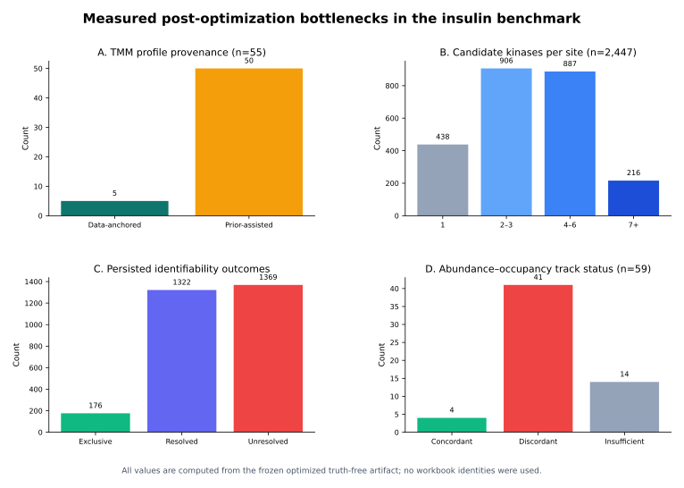

# Insulin benchmark 후속 개발 기회 검토 v1

**작성자:** Manus AI  
**평가 대상:** frozen optimized truth-free artifact  
**기준 contract:** `truth_free_temporal_optimized.v1`

## 1. 결론

현재 파이프라인은 raw PR/PG/FASTA에서 2,447개 mapped site, 8개 Wave, 55개 TMM profile, 4,486개 contribution key와 6개 cascade timepoint를 생성하므로 **실행 자체는 완주한다**. 그러나 실제 artifact를 다시 감사한 결과, 다음 개발에서 가장 큰 향상 가능성은 threshold를 더 조정하는 데 있지 않고 **candidate graph의 확률화·계층 정리, kinase activity의 module-size 보정, data-driven profile 확장과 uncertainty propagation**에 있다.

가장 먼저 수정해야 할 것은 정확성 문제다. Contribution matrix가 `GENE_S123`과 `GENE S123`을 동시에 저장해 biological site 2,447개보다 많은 4,486개 key를 만들고 있다. 이는 계산값을 새로 만들어낸 것은 아니지만 source-data row와 downstream join을 이중화할 수 있다. 둘째, cascade가 fractional activity의 **합**으로 kinase를 정렬하므로 broad motif module의 substrate 수가 activity rank를 지배한다. 실제로 summed score의 top 5는 거의 모든 timepoint에서 CSNK2·MAPK·CAMK·CDK·GSK3B로 고정되지만, 동일 값을 fractional support로 나눈 counterfactual에서는 모든 timepoint에서 top-5 overlap이 0이었다. 따라서 현재 Figure 4는 biological effect size와 evidence mass를 분리하지 못한다.

셋째, 55개 profile 중 data-anchored profile은 5개뿐이고 50개는 expected-peak Gaussian prior이다. 모든 profile의 candidate evidence도 `motif_only_seed`이다. 넷째, 2,447개 site 중 2개 이상 후보를 가진 site가 2,009개이지만 contribution matrix의 non-zero candidate median은 1이고 max-share median도 1.0이다. 즉 multi-candidate graph는 생성됐지만 최종 NNLS가 대부분 one-hot attribution을 반환한다. 다섯째, abundance–occupancy dual-track은 59개 kinase 중 4개만 concordant하고 41개는 discordant하므로, 이를 단순 통합하지 말고 biological divergence와 technical disagreement를 분리해야 한다.

## 2. 실제 artifact에서 확인된 병목

| 병목 | 실측값 | 의미 |
|---|---:|---|
| Data-anchored TMM profile | 5/55, 9.1% | 대부분의 profile shape가 raw exclusive substrate가 아니라 prior에서 옴 |
| Prior-assisted profile | 50/55, 90.9% | directionality와 contribution에 prior shape가 강하게 반영될 수 있음 |
| Motif-only input evidence | 55/55 | direct kinase–site evidence가 profile 후보에 없음 |
| Candidate multiplicity | median 3, max 14 | multi-kinase ambiguity가 실제로 큼 |
| Single-candidate site | 438/2,447, 17.9% | 82.1%는 shared-candidate site |
| Contribution max share | median 1.0 | multi-candidate 입력이 대부분 one-hot 결과로 축소됨 |
| Unresolved shared attribution | 1,369 records | ambiguity group 내부 ratio를 발표할 수 없음 |
| Dual-track concordance | 4/59 | abundance와 occupancy evidence가 대부분 일치하지 않음 |
| Current pair directionality | 0 | stable edge가 현재 summed activity에서 통과하지 않음 |
| Locked measurable anchors | 2 unweighted; weighted denominator 3 | primary score가 Wave/TMM 개선에 둔감함 |
| Chain completeness | 0 | 현재 branch evidence가 canonical chain을 충분히 평가하지 못함 |

Kinase activity inference의 성능은 사용한 kinase–substrate library와 substrate 수에 크게 영향을 받고, predicted edge를 추가하면 coverage는 증가하지만 calibration이 필요하다.[1] PhosX는 motif raw match 대신 proteome-background quantile로 sequence specificity를 보정하고, related kinase specificity의 상관과 localization·expression 미반영을 주요 한계로 지적한다.[2] 현재 PTM-platform의 binary motif-family membership은 바로 이 한계에 노출되어 있다.

## 3. P0: 서버 기본값 승격 전에 필요한 개발

### 3.1 P0-A — Canonical PTM key와 track-separated contribution contract

`build_tmm_site_contribution_matrix()`는 underscore key를 space alias로 복제한다. 이 alias는 UI convenience였지만 publication/source-data contract에서는 별도 biological record처럼 보인다. Canonical key는 `GENE_SITE` 하나만 저장하고 display label은 별도 필드로 분리해야 한다. Relative abundance와 occupancy contribution matrix도 각각 `relative_site_contribution_matrix`와 `occupancy_site_contribution_matrix`로 나눠야 한다.

| Acceptance criterion | 기준 |
|---|---|
| Relative contribution key | 2,447개 이하이며 canonical key 중복 0 |
| Alias row | artifact/source TSV에서 0 |
| Occupancy track | 별도 matrix와 explicit track provenance |
| Figure 3 source | biological site와 track이 각각 명시됨 |
| Existing UI | display label은 유지하되 calculation key로 사용하지 않음 |

이 수정은 score 향상보다 **artifact correctness와 논문 재현성**을 위한 필수 P0이다.

### 3.2 P0-B — Activity effect size와 evidence mass의 이중 score

현재 cascade profile은 `weighted_up_sums + weighted_down_sums`이며, activity threshold도 이 합에 적용된다. Module이 큰 kinase는 작은 평균 변화라도 높은 rank를 얻는다. Counterfactual로 summed activity를 fractional support로 나누면 timepoint별 top 5가 모두 교체됐고 같은 directionality engine에서 D1 edge 18개가 생겼다. 그러나 18개 중 15개는 양 endpoint가 모두 prior-assisted이므로 이 결과를 바로 채택해서는 안 된다.

다음 contract가 적절하다.

| 출력 | 정의 | 사용처 |
|---|---|---|
| `activity_effect_size` | weighted signed sum / fractional support의 robust mean | timepoint rank와 temporal shape |
| `evidence_mass` | fractional support와 absolute weighted sum | confidence와 marker size |
| `shrunken_activity` | effect size × support-dependent shrinkage | low-support rank 안정화 |
| `raw_weighted_sum` | 현재 값 | backward-compatible provenance |

Figure 4는 x축 또는 색으로 effect size를, node size로 evidence mass를 표현해야 한다. 새 rank가 **3-fold replicate holdout residual을 악화시키지 않고**, fold별 top-k stability를 개선할 때만 승격한다. Locked score는 configuration freeze 후에만 확인한다.

### 3.3 P0-C — Quantitative motif likelihood와 kinase-family ambiguity hierarchy

현재 graph에는 `CDK`와 `CDK1/CDK2`, `CAMK`와 `CAMK2`, `SRC-FAMILY TK`와 `SRC/FYN/YES`처럼 family-level과 gene-level candidate가 동시에 존재한다. Broad modules는 CSNK2 1,391 sites, CDK 1,361, MAPK 1,361로 activity sum을 지배한다.

Binary membership 대신 다음 edge contract가 필요하다.

> **Candidate edge = calibrated motif likelihood × expression/presence compatibility × direct-evidence multiplier × localization compatibility, with an explicit kinase-family ambiguity group.**

PhosX는 PSSM score를 proteome-wide background quantile로 변환하고 top-scoring kinase 후보를 사용한다.[2] PTM-platform에서도 motif score를 quantile 또는 empirical null로 calibration하고, related kinase가 분리되지 않으면 family-level share만 발표해야 한다. Direct site evidence나 충분한 exclusive trajectory가 있을 때만 family 내부 gene-level attribution을 허용한다.

| Acceptance criterion | 기준 |
|---|---|
| Family/gene duplicate | 같은 site에서 동시 독립 coefficient 0 |
| Candidate edge | continuous score와 source provenance 포함 |
| Null calibration | sequence permutation 또는 proteome-background quantile |
| Family resolution | identifiability evidence가 없으면 family-level output |
| Blindness | treatment/workbook/RAG identity 사용 금지 |

## 4. P1: 성능과 학술적 차별성을 높이는 개발

### 4.1 P1-A — Iterative data-derived profile estimation

Hard-exclusive substrate만으로 profile을 만들면 multi-candidate graph가 풍부해질수록 exclusive set이 줄어드는 역설이 생긴다. 현재 5/55만 data-anchored인 이유다. 다음 단계는 모든 shared site를 즉시 hard assignment하지 않고, motif likelihood로 초기화한 뒤 kinase profile과 site contribution을 교대로 업데이트하는 hierarchical/EM 방식이다.

IKAP는 여러 timepoint를 동시에 사용해 kinase activity와 kinase–site affinity를 함께 추정하고 identifiability를 별도로 점검한다.[3] PTM-platform은 이를 그대로 복제하기보다 기존 TMM guard를 유지한 상태에서 다음과 같이 제한적으로 확장하는 것이 안전하다.

1. Direct/exclusive site로 초기 profile을 만든다.
2. High-identifiability shared site만 soft weight로 profile update에 사용한다.
3. Replicate bootstrap마다 profile과 contribution을 다시 추정한다.
4. Profile correlation, contribution CI, fold reconstruction이 안정된 kinase만 `data_anchored_iterative`로 승격한다.
5. 불안정한 kinase는 family share 또는 prior-assisted 상태로 남긴다.

성공 기준은 data-anchored profile 수 자체가 아니라 **held-out reconstruction, bootstrap CI width, family-resolution accuracy와 perturbation rank**다. Profile 수를 목표로 삼으면 overfitting을 유도한다.

### 4.2 P1-B — Replicate-bootstrap consensus Wave와 soft membership

현재 Wave evidence의 `replicate_stability`는 `None`이며 최종 membership은 aggregated trajectory에 대한 단일 hierarchical clustering 결과다. Optimization에는 replicate ARI를 사용했지만 그 불확실성이 production artifact에 전달되지 않는다.

CLUster evaluation 연구는 time-course cluster가 cluster 수, prior completeness와 annotation noise에 민감하며 fuzzy membership이 boundary site를 표현할 수 있음을 보여준다.[4] Strict benchmark에서는 kinase prior로 Wave를 정답 유도하면 안 되므로, 다음 truth-free consensus contract가 적합하다.

| 새 필드 | 정의 |
|---|---|
| `membership_probability` | replicate/bootstrap co-assignment probability |
| `consensus_wave_id` | consensus matrix 기반 cluster |
| `boundary_memberships` | 두 Wave에 유사한 soft membership |
| `replicate_stability` | per-Wave median co-assignment |
| `unstable_member_fraction` | predefined confidence 미만 site 비율 |

이 개발은 canonical score보다 **Wave 재현성, TMM profile 품질과 논문 방법론**을 강화한다.

### 4.3 P1-C — Adaptive contribution uncertainty

현재 ambiguity-aware attribution은 production에서 `n_bootstrap=0`으로 호출되며, resolved ratio에도 CI가 없다. Candidate가 최대 14개이고 timepoint가 6개이므로 one-hot NNLS coefficient를 확정값처럼 해석하기 어렵다. 모든 4,486 row에 무조건 bootstrap을 적용하면 비용이 크므로 adaptive strategy가 적합하다.

| 대상 | Bootstrap 정책 |
|---|---|
| Exclusive site | 불필요, ratio 1과 evidence type만 기록 |
| Unresolved group | individual ratio를 계속 withheld |
| Resolved shared site | replicate bootstrap 및 leave-one-timepoint-out |
| Top publication site | 더 많은 resample과 coefficient CI |
| Low-support site | prior-assisted label과 broad interval |

`contribution_ci`, `top1_probability`, `sign_stability`, `condition_number`, `LOTO_stability`를 source TSV에 추가한다. 이것은 Figure 3의 가장 중요한 학술적 보강이다.

### 4.4 P1-D — Dual-track concordance를 confidence calibration으로 사용

Occupancy track은 977 input site 중 820개 complete vector를 제공하지만 kinase-level 결과는 4 concordant, 41 discordant, 14 insufficient다. Discordance는 오류일 수도 있고 protein abundance 보정으로 드러난 biological difference일 수도 있으므로 자동 감점하면 안 된다.

다음처럼 분류해야 한다.

| 상태 | 해석 |
|---|---|
| `dual_track_concordant` | relative와 occupancy timing/direction/top contribution이 일치 |
| `abundance_coupled_signal` | relative에서만 강하고 occupancy에서 약화 |
| `occupancy_specific_signal` | occupancy에서만 명확 |
| `track_discordance_unresolved` | 서로 충돌하며 추가 검증 필요 |
| `occupancy_insufficient` | complete paired vector 부족 |

이 분류는 rank를 직접 변경하기보다 evidence tier와 Report wording에 먼저 사용해야 한다.

## 5. P2: 평가 민감도와 후속 논문을 위한 개발

### 5.1 P2-A — Secondary kinase/temporal locked scorer

현재 46개 canonical anchor 중 44개는 artifact에 없어서 `not_declared_measurable`이고, unweighted measurable anchor는 2개뿐이다. 따라서 primary canonical score 0.733은 site-level anchor의 좁은 평가이며 Wave/TMM 개선에 거의 반응하지 않는다. Primary score는 변경하면 안 되지만, workbook에 이미 존재하는 kinase reference와 temporal layer를 사용하는 **secondary locked metric**을 추가할 수 있다.

권장 secondary metric은 kinase-family rank, expected temporal window overlap, branch macro-average, early/mid/late layer coverage, data-anchored vs prior-assisted recovery다. 이 metric은 별도 표와 Supplementary figure로 보고하고 primary composite에 합치지 않는다.

### 5.2 P2-B — Evidence-gated directionality

Current summed activity에서는 directionality edge가 0이다. Support-normalized counterfactual은 D1 edge 18개를 만들었지만 15개는 prior-assisted endpoint끼리의 edge다. 따라서 edge 수를 늘리는 것이 목표가 되어서는 안 된다.

Directionality는 다음 gate를 통과한 경우에만 발표하는 것이 적절하다.

| Gate | 요구 조건 |
|---|---|
| D0 | profile 존재만 확인 |
| D1-observed | normalized shape의 onset/peak precedence |
| D1-replicate | bootstrap direction probability와 LOTO stability |
| D2-supported | 적어도 한 endpoint가 data-anchored이며 independent evidence 존재 |
| D3-perturbation | 후속 inhibitor/perturbation에서 관계가 유지 |

Prior-assisted × prior-assisted edge는 `prior-shaped ordering candidate`로 분리하고 main cascade edge로 그리지 않는다.

## 6. 개발 우선순위

| 우선순위 | 개발 항목 | 예상 향상 | 위험 | 난이도 | 논문 기여도 |
|---|---|---|---|---|---|
| P0-1 | Canonical key·track 분리 | source-data 정확성 매우 높음 | 낮음 | 낮음 | 높음 |
| P0-2 | Effect size/evidence mass dual score | cascade rank 편향 감소 매우 높음 | 중간 | 중간 | 매우 높음 |
| P0-3 | Quantitative motif·family hierarchy | candidate specificity·identifiability 매우 높음 | 중간 | 높음 | 매우 높음 |
| P1-1 | Iterative data-derived profiles | prior 의존 감소 높음 | 높음 | 높음 | 매우 높음 |
| P1-2 | Consensus Wave membership | 재현성과 uncertainty 높음 | 낮음 | 중간 | 높음 |
| P1-3 | Adaptive contribution CI | TMM 주장 신뢰도 높음 | 낮음 | 중간–높음 | 매우 높음 |
| P1-4 | Dual-track evidence calibration | abundance confounding 해석 중간–높음 | 중간 | 중간 | 높음 |
| P2-1 | Secondary locked scorer | benchmark 민감도 높음 | 낮음 | 중간 | 매우 높음 |
| P2-2 | Evidence-gated directionality | false edge 억제·설명력 중간 | 낮음 | 중간 | 높음 |

## 7. 권장 구현 순서와 중단 기준

첫 release는 P0-A와 P0-B만 구현해 artifact correctness와 cascade rank를 검증하는 것이 좋다. P0-B의 normalized rank가 current rank와 크게 다르므로 기존 결과를 즉시 덮어쓰지 말고 `sum_activity`와 `support_normalized_activity`를 병렬 저장한다. Replicate holdout, site permutation과 frozen locked test를 통과한 뒤 primary display를 결정한다.

두 번째 release에서 P0-C와 P1-C를 함께 구현한다. Candidate calibration과 uncertainty를 분리하면 continuous motif score가 결과를 바꿨는지, 단지 CI가 넓어진 것인지 구별할 수 있다. 세 번째 release에서 consensus Wave와 iterative profile을 추가한다. 마지막으로 secondary locked scorer와 evidence-gated directionality를 적용한다.

다음 조건 중 하나가 발생하면 해당 개선의 승격을 중단한다.

| Stop criterion | 이유 |
|---|---|
| Replicate holdout residual이 현재보다 2% 이상 악화 | apparent specificity가 reconstruction을 희생 |
| Independent subset에서 kinase rank 상관이 크게 하락 | configuration instability |
| Candidate calibration 후 family ambiguity가 증가 | gene-level 과해석 위험 |
| Bootstrap top1 probability가 낮은데 ratio만 sharp | false precision |
| Locked primary score가 하락 | canonical safety regression |
| Permuted time labels에서도 같은 cascade가 유지 | temporal specificity 부족 |
| Prior-assisted edge만 증가 | data evidence가 아닌 prior 구조 증폭 |

## 8. 실험 설계 측면의 가장 큰 추가 개선

현재 timepoint는 1, 5, 15, 30, 60, 180분이다. Insulin receptor와 proximal kinase의 매우 빠른 onset은 첫 1분 이전에 발생할 수 있어, code만으로 0–5분 순서를 복구하는 데 한계가 있다. 향후 독립 dataset에서는 0, 0.5, 1, 2, 5, 10분의 early sampling을 강화하고 이후 15, 30, 60, 180분을 유지하는 것이 directionality validation에 가장 효과적이다. IKAP의 insulin application도 0–10분 사이의 촘촘한 여덟 timepoint를 사용했다.[3]

후속 inhibitor dataset은 discovery 단계와 분리하여 frozen model을 검증하는 용도로 사용해야 한다. 즉 현재 raw insulin data로 candidate를 만들고 configuration을 동결한 뒤, inhibitor contrast에서 target kinase rank, target Wave와 downstream contribution이 선택적으로 감소하는지를 검증한다.

## 9. 최종 권고

추가 개발로 실제 성능을 높일 여지는 분명히 있다. 다만 다음 향상은 **더 많은 TMM profile이나 더 많은 directionality edge를 만드는 것**이 아니라, 적은 수라도 data-anchored·size-corrected·uncertainty-bounded result를 만드는 방향이어야 한다. 가장 합리적인 다음 작업은 `P0-A canonical key/track separation`과 `P0-B dual activity score`를 먼저 구현해 동일 raw data에서 Figure 3–4 rank와 source data가 어떻게 달라지는지 재검증하는 것이다. 그 후 quantitative motif hierarchy와 adaptive CI를 추가하면 PTM-platform의 핵심 차별점인 time-resolved multi-kinase attribution을 논문에서 훨씬 강하게 방어할 수 있다.

## References

[1]: https://pmc.ncbi.nlm.nih.gov/articles/PMC12098709/ "Müller-Dott et al. Comprehensive evaluation of phosphoproteomic-based kinase activity inference. Nature Communications, 2025."

[2]: https://pmc.ncbi.nlm.nih.gov/articles/PMC11630834/ "Lussana et al. PhosX: data-driven kinase activity inference from phosphoproteomics experiments. Bioinformatics, 2024."

[3]: https://academic.oup.com/bioinformatics/article/32/3/424/1744392 "Mischnik et al. IKAP: A heuristic framework for inference of kinase activities from phosphoproteomics data. Bioinformatics, 2016."

[4]: https://journals.plos.org/ploscompbiol/article?id=10.1371/journal.pcbi.1004403 "Yang et al. Knowledge-Based Analysis for Detecting Key Signaling Events from Time-Series Phosphoproteomics Data. PLOS Computational Biology, 2015."
