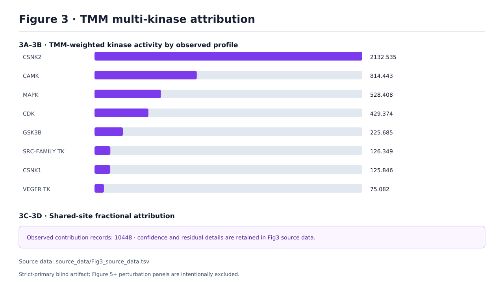
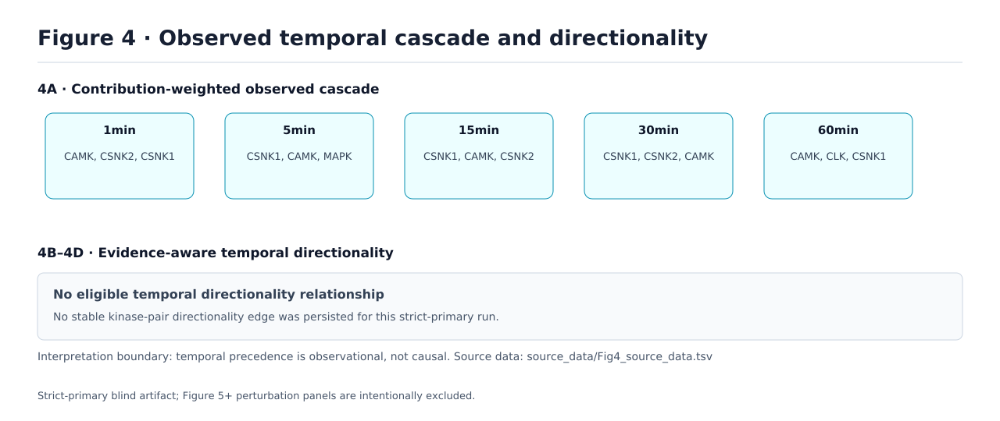

# Strict-blind Temporal Attribution Upgrade v2

**Author:** Manus AI

**Status:** Frozen configuration validated on the user-supplied PR/PG matrices and Rat+human INSR FASTA

**Contract:** `truth_free_temporal_optimized.v2`

## 1. 목적과 결론

본 개발은 insulin identity, biological question, cell-line identity, report/RAG context와 locked workbook truth를 분석·변수 선택 runtime에서 제거한 상태로 Temporal Wave, multi-candidate TMM, cascade와 uncertainty를 개선하는 작업이다. Workbook은 configuration 동결 후 runner-only offline scorer에서만 사용했다.

최종 configuration의 SHA-256은 **`ee1671c91e1b8913b35e7eb95c1d9ea3ed916b1f220c69d31a1bbeb96dfa9455`**이며, 선택 ledger SHA-256은 **`2a6c7c728b2b931cb00f275e39be721a4ed904f95c566077219c3f5c254201e1`**이다. 모든 반복 trial은 input hash, code revision, variable config, fold metric, decision과 이전 record hash를 포함한다.

> **핵심 결론:** P0–P2 기능은 모두 구현되었으나, 모든 기능을 final analysis에 강제로 활성화하지 않았다. Iterative profile refinement는 15개 truth-free configuration에서 rounds-zero baseline을 이기지 못했으므로 구현 상태로 보존하되 frozen run에서는 비활성화했다. 이는 benchmark 적합화가 아니라 사전 정의된 중단 기준을 실제로 적용한 결과이다.

## 2. Strict-blind 경계

| 구분 | 변수 선택 runtime에서 허용 | 변수 선택 runtime에서 금지 |
|---|---|---|
| Quantitative evidence | PR/PG matrix 수치, replicate, minute axis, q-value, protein normalization | Treatment/stimulus identity |
| Sequence evidence | FASTA sequence, accession, isoform, species provenance, observed motif window | Workbook anchor identity와 expected pathway |
| Context | Controlled lineage class | Exact cell line, transgene/overexpression identity, biological question |
| Evaluation | Replicate holdout, LOTO, reconstruction, rank stability, parsimony | Locked score, reference kinase list, temporal reference layer |
| Post-freeze | Runner-only canonical·secondary locked scoring | Scoring 결과를 이용한 parameter 재선택 |

같은 validation score를 tuning과 성능 추정에 동시에 사용하면 낙관적 편향이 커질 수 있으므로, 본 연구는 grouped replicate folds와 locked post-selection evaluation을 분리했다.[1] [2] Model-selection criterion 자체가 finite sample에서 과적합될 수 있다는 점을 고려해 단일 최고값 대신 fold stability, worst-fold behavior와 parsimony를 함께 사용했다.[1]

## 3. 데이터에서 알고리즘으로 이어지는 추적 경로

| 단계 | 입력 | 계산 | 저장된 설명 가능성 |
|---|---|---|---|
| 0층 preprocessing | PR 177,118 rows, PG 9,527 rows, 21 samples | protein-normalized phosphosite relative abundance | normalized vector, replicate-level site table |
| Site contract | precursor rows | median gene–site–condition aggregation | aggregation mode와 config hash |
| Sequence mapping | Rat proteome + human INSR FASTA | sequence+isoform+species mapping | accession별 FASTA OX provenance |
| Temporal Wave | 2,447 site trajectories | correlation/amplitude clustering + 25 replicate bootstraps | hard members, consensus probability, replicate stability |
| Candidate graph | observed sequence windows | background-calibrated motif likelihood + family hierarchy | site–kinase probability, family parent, input evidence tier |
| TMM | candidate profiles + shared-site trajectory | NNLS, collinearity gate, candidate-prior tie calibration | contribution, guard outcome, residual, profile type |
| Activity | fractional contributions | raw sum, effect size, evidence mass, shrunken mean | all activity tracks와 selected metric |
| Uncertainty | resolved required singleton groups | 50 bootstrap + leave-one-timepoint-out | top-group stability와 CI provenance |
| Directionality | TMM profiles | observational precedence + endpoint evidence gate | main edges와 exploratory candidates 분리 |
| Locked score | frozen truth-free artifact | runner-only primary + secondary scoring | denominator와 claim boundary |

Sequence motif는 kinase specificity의 한 구성요소이며 cellular specificity 전체를 의미하지 않는다. 가까운 kinase isozyme은 motif만으로 구별하기 어렵기 때문에 background-normalized likelihood와 family-level ambiguity를 함께 보존했다.[3] Phosphosite–kinase assignment는 본질적으로 multi-label일 수 있으므로 후보를 winner-take-all로 제거하지 않고 TMM-only graph에서 유지했다.[4]

## 4. 구현된 개선과 최종 결정

| 개발 항목 | 구현 | Frozen-v2 결정 | 이유 |
|---|---:|---|---|
| Canonical PTM key | 완료 | 활성 | `GENE_SITE` alias 중복 제거 |
| Relative/occupancy matrix 분리 | 완료 | 활성 | 두 track의 계산·source-data provenance 분리 |
| Raw sum/effect size/evidence mass | 완료 | 모두 저장 | 효과크기와 substrate support를 구별 |
| Empirical-Bayes shrinkage | 완료 | `shrunken_mean`, prior 10 | module-size bias를 줄이면서 holdout rank 안정성 보존 |
| Motif likelihood | 완료 | prior strength 5 | temporally unidentified collinear group에만 sequence support 적용 |
| Kinase hierarchy | 완료 | `family_guard` | family와 isozyme coefficient의 중복 해석 방지 |
| Iterative profile refinement | 완료 | **rounds 0** | 모든 iterative setting이 preregistered objective에서 baseline 이하 |
| Consensus Wave | 완료 | 25 bootstrap, threshold 0.60 | 실제 replicate 기반 membership stability 저장 |
| Dual-track classification | 완료 | correlation 0.50, peak tolerance 2 | concordant와 discordant를 별도 evidence class로 보존 |
| Adaptive uncertainty | 완료 | bootstrap 50 + LOTO | supported singleton group만 평가, ambiguous ratio는 계속 withheld |
| Evidence-gated directionality | 완료 | D2+ 및 양 endpoint data-anchored만 main | prior×prior와 D1을 main edge로 승격하지 않음 |
| Secondary locked scorer | 완료 | primary와 별도 | kinase-family와 temporal-layer 결과가 primary score를 변경하지 않음 |
| Portable SVG | 완료 | text-to-path | 서버·browser font 차이 없이 Figure text 표시 |

## 5. 반복 최적화 기록

| Trial | 선택 변수 | 결정 | Truth 사용 |
|---|---|---|---:|
| Baseline | frozen v1 | 기준선 | 아니오 |
| P0-A | canonical key + track separation | 선택 | 아니오 |
| P0-B | shrunken mean, prior 10 | 선택 | 아니오 |
| P0-C | motif prior strength 5 | 선택 | 아니오 |
| P1 iterative | rounds 0/1/2/3/5 × top1 0.70/0.80/0.90 | **reject; rounds 0 유지** | 아니오 |
| P1 consensus Wave | bootstrap 25/50/100 × threshold 0.60/0.70/0.80 | 25, 0.60 선택 | 아니오 |
| P1 dual-track | correlation 0.30/0.50/0.70 × lag 1/2/3 | 0.50, 2 선택 | 아니오 |
| P1 uncertainty | bootstrap 50/100/200 × LOTO off/on | 50 + LOTO 선택 | 아니오 |

Ledger는 `benchmarks/insulin_signaling_v1/optimization_v2/strict_blind_trials_v2.jsonl`에 저장된다. 마지막 record SHA-256은 `f535cb2e319de574395b7e108216832ba5154d1c4a0bf4f415321f6db59f1b7a`이다.

## 6. Frozen-v2 실제 raw-data 결과

| 산출물 | 값 |
|---|---:|
| Sequence+isoform+species mapped sites | 2,447 |
| Canonical Waves | 8 |
| Kinase score rows | 141 |
| Canonical contribution sites | 2,243 |
| Relative uncertainty evaluated sites | 1,835 |
| Resolved uncertainty sites | 1,485 |
| Bootstrap top-1 stability median | 1.000 |
| Bootstrap stability ≥0.8 | 88.8% |
| LOTO top-group stability median | 0.833 |
| LOTO stability ≥0.8 | 74.8% |
| Cascade timepoints | 6 |
| Main directionality edges | 0 |

Wave별 replicate stability는 0.20–0.88 범위였다. 이는 hard clustering 결과를 폐기하는 값이 아니라 각 Wave의 structural co-movement가 replicate resampling에서 얼마나 반복되는지 나타내는 별도 evidence이다. 낮은 stability Wave는 discovery로 보존하되 main mechanistic statement의 근거로 단독 사용하지 않는다.

Dual-track 59개 kinase의 final 분포는 `dual_track_concordant` 10, `magnitude_discordant` 17, `trajectory_discordant` 16, `direction_discordant` 11, `relative_only` 3, `unavailable` 2였다. Discordance는 오류가 아니라 abundance와 occupancy-like track이 서로 다른 관측을 제공했다는 결과로 기록된다.

## 7. Final locked evaluation

### 7.1 Primary canonical metrics

| Metric | Result | Denominator |
|---|---:|---:|
| Detectable anchor recall | 1.000 | 3 |
| Regulated anchor recall | 0.333 | 3 |
| Direction accuracy | 1.000 | 1 |
| Peak-window accuracy | 1.000 | 1 |
| Chain completeness | 0.000 | branch rule |
| Canonical weighted score | **0.7333** | weighted components |

Primary score가 v1과 같다는 점은 실패가 아니다. P0–P2는 작은 canonical denominator에 직접 최적화되지 않았고, multi-candidate attribution, replicate stability와 uncertainty를 개선했다. 따라서 논문에서는 primary recovery의 non-inferiority와 temporal attribution evidence의 확장을 함께 제시한다.

### 7.2 Secondary runner-only metrics

| Metric | Result | Denominator |
|---|---:|---:|
| Kinase-family reference coverage | 0.467 | 15 |
| Data-anchored kinase coverage | 0.000 | 15 |
| Expected direction accuracy | 0.600 | 5 evaluable |
| Expected timing accuracy | 0.000 | 4 evaluable |
| Temporal-layer coverage | 0.857 | 7 |

Secondary 결과는 현재 가장 중요한 한계를 보여준다. Motif-seeded TMM이 reference family 일부를 구조적으로 포괄하지만, matching된 kinase도 data-anchored profile이 아니며 예상 timing을 맞추지 못했다. 이 결과는 숨기거나 점수에 합산하지 않는다. Kinase inference benchmark 성능은 library coverage와 substrate count에 크게 영향을 받으므로 predicted edge 확대와 validated evidence를 분리해야 한다.[5] [6]

## 8. Figure와 source data

Figure 3은 실제 TMM activity와 10,448 relative/occupancy contribution records를 표시한다. Source TSV에는 profile type, candidate evidence, uncertainty summary와 dual-track class가 포함된다.

Figure 4는 six-timepoint shrunken-activity cascade를 표시한다. Main directionality edge가 0인 것은 계산 누락이 아니라 D2+와 양 endpoint data-anchored gate를 통과한 관계가 없기 때문이다. Temporal precedence는 observational evidence이며 causal claim이 아니다.

## 9. 논문 전략

본 연구의 주요 방법론 기여는 “insulin expected pathway를 얼마나 많이 맞췄는가” 하나가 아니다. 더 방어 가능한 논문 구조는 다음과 같다.

| Claim layer | 권장 주장 | 금지 주장 |
|---|---|---|
| Primary | Canonical recovery를 유지했다 | 작은 denominator의 0.7333을 일반 성능으로 확대 |
| Wave | Replicate consensus와 site membership uncertainty를 제공한다 | Co-wave가 공통 kinase 또는 causality를 증명한다 |
| TMM | Multi-label candidate graph와 identifiability gate를 사용한다 | Motif prior를 direct substrate evidence로 표현한다 |
| Cascade | Effect size와 evidence mass를 분리한다 | Shrunken activity rank를 pathway truth로 간주한다 |
| Directionality | D0–D3와 evidence gate로 main/candidate를 구분한다 | D1 temporal precedence를 causal edge로 표현한다 |
| Validation | 후속 inhibitor set를 frozen model의 independent perturbation test로 사용한다 | Inhibitor 결과를 다시 tuning에 사용한다 |

계산 또는 in-vitro network 확장은 coverage를 크게 높일 수 있지만 accuracy 향상은 제한적일 수 있고, curated truth 자체도 불완전하다.[6] 그러므로 후속 inhibitor time course는 현재 frozen-v2를 변경하지 않은 상태에서 DQ4 perturbation-supported evidence로 평가해야 한다.

## 10. 서버 acceptance criteria

| Check | Acceptance |
|---|---|
| Runtime config SHA | `ee1671c9…9455` |
| Ledger SHA | `2a6c7c72…01e1` |
| Site mapping | 2,447 sequence+isoform+species |
| Contribution keys | canonical only; no space aliases |
| Consensus Wave | 25 repeats, probability and replicate stability present |
| Activity | `shrunken_mean`, prior support 10 |
| Candidate prior | strength 5, `family_guard` |
| Iterative profile | rounds 0 |
| Uncertainty | bootstrap 50 + LOTO, ambiguous ratios withheld |
| Directionality | main/candidate lists separated by evidence gate |
| SVG | zero text nodes, glyph paths present |
| Primary locked score | 0.7333 with unchanged denominators |

## References

[1]: https://jmlr.org/papers/v11/cawley10a.html "On Over-fitting in Model Selection and Subsequent Selection Bias in Performance Evaluation"
[2]: https://link.springer.com/article/10.1186/1471-2105-7-91 "Bias in error estimation when using cross-validation for model selection"
[3]: https://pmc.ncbi.nlm.nih.gov/articles/PMC6611643/ "Evolution of protein kinase substrate recognition at the active site"
[4]: https://pmc.ncbi.nlm.nih.gov/articles/PMC9132282/ "Accurate, high-coverage assignment of in vivo protein kinases to phosphosites from in vitro phosphoproteomic specificity data"
[5]: https://www.nature.com/articles/s41467-025-59779-y "Comprehensive evaluation of phosphoproteomic-based kinase activity inference"
[6]: https://www.nature.com/articles/s41467-026-69332-0 "Evaluation of kinase–substrate networks for phosphoproteomic activity inference"
